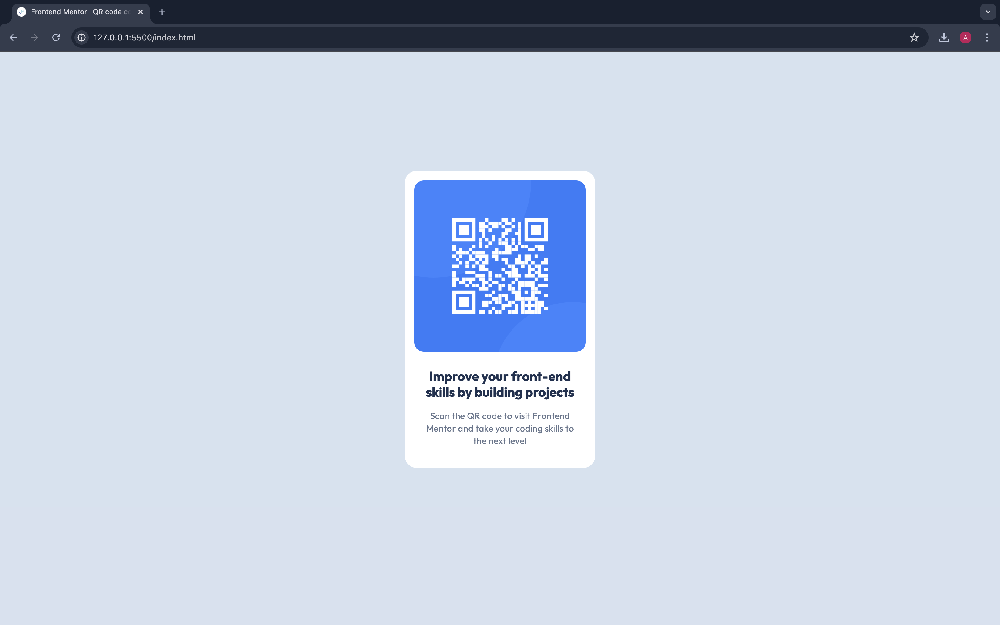

# Frontend Mentor - QR code component solution

This is a solution to the [QR code component challenge on Frontend Mentor](https://www.frontendmentor.io/challenges/qr-code-component-iux_sIO_H). Frontend Mentor challenges help you improve your coding skills by building realistic projects.

## Table of contents

- [Overview](#overview)
  - [Screenshot](#screenshot)
  - [Links](#links)
- [My process](#my-process)
  - [Built with](#built-with)
  - [What I learned](#what-i-learned)
  - [Continued development](#continued-development)
- [Author](#author)
- [Acknowledgments](#acknowledgments)

## Overview

### Screenshot



### Links

- Solution URL: [Github](https://github.com/meandrewaprianto/qr-code-componen)
- Live Site URL: [Vercel](https://qr-code-component-gilt-six.vercel.app/)

## My process

### Built with

- Semantic HTML5 markup
- CSS custom properties

### What I learned

The Power for center an element with margin auto.

```css
.box {
  margin: auto;
}
```

### Continued development

Trying with css flexbox

## Author

- Website - [andrewaprianto](https://qr-code-component-gilt-six.vercel.app/)
- Frontend Mentor - [meandrewaprianto](https://www.frontendmentor.io/profile/meandrewaprianto)
